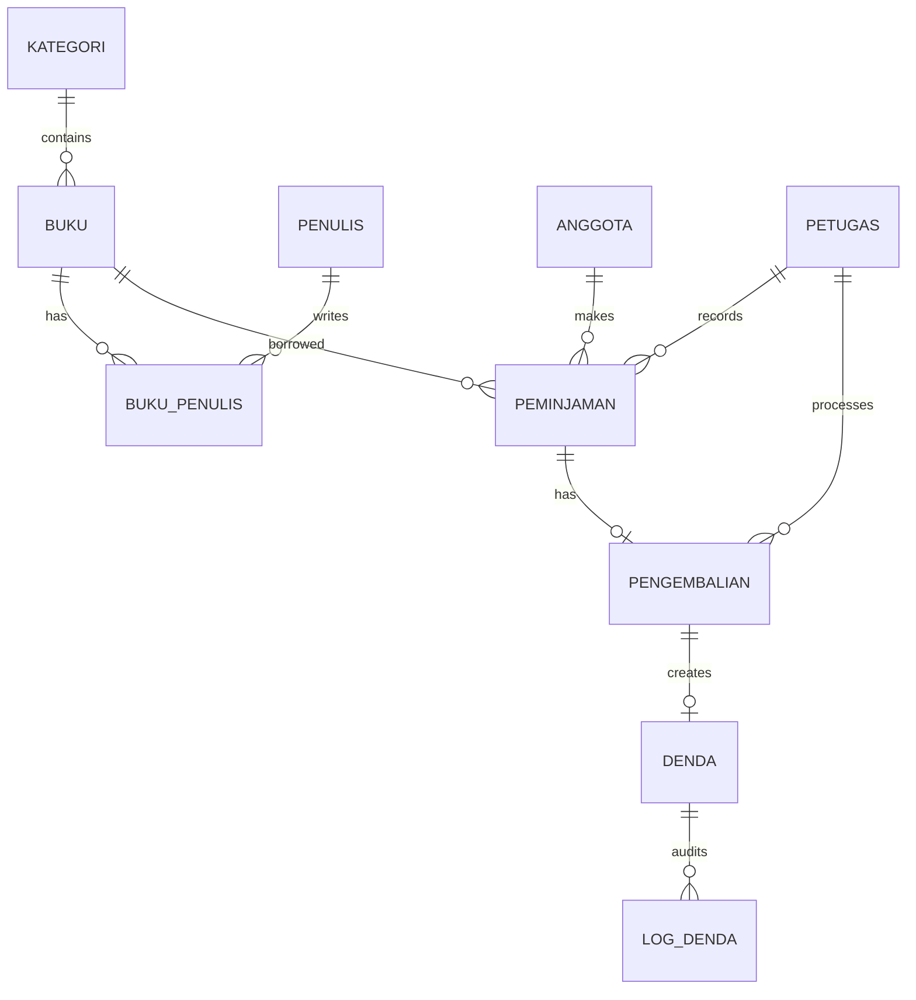

# SiLibrary — Digital Library Database

An academic MySQL database implementation for a digital library information system. SiLibrary models catalog data, members, staff, borrowing, returns, late-payment penalties, stored procedures, triggers, and database access roles.

## Snapshot

| Item | Detail |
| --- | --- |
| Project type | Academic team project for Database Systems |
| Database | MySQL 8.0+ |
| Core entities | Categories, authors, books, members, staff, loans, returns, and fines |
| Relationship model | 1:N and M:N relationships, including `buku_penulis` |
| SQL features | DDL, seed data, procedures, triggers, joins, nested queries, and DCL examples |

## Data model

- `kategori` → `buku`: one-to-many
- `buku` ↔ `penulis`: many-to-many through `buku_penulis`
- `anggota` → `peminjaman`: one-to-many
- `petugas` → `peminjaman`: one-to-many
- `peminjaman` → `pengembalian`: zero-or-one return per loan
- `pengembalian` → `denda`: zero-or-one fine per return
- `log_denda`: audit trail when a fine changes to paid

## Repository structure

```text
sql/
├── 01_schema_and_seed.sql          # Database, tables, constraints, and sample data
├── 02_procedures_and_triggers.sql  # Procedures and business-rule triggers
├── 03_demo_queries.sql             # Demonstration queries and transaction flow
└── 04_dcl_examples.sql             # Role and privilege examples
```

## Import locally

> `01_schema_and_seed.sql` begins with `DROP DATABASE IF EXISTS silibrary`. Use a local or disposable MySQL instance only.

Run the scripts in order:

```bash
mysql -u root -p < sql/01_schema_and_seed.sql
mysql -u root -p silibrary < sql/02_procedures_and_triggers.sql
mysql -u root -p silibrary < sql/03_demo_queries.sql
```

The final demo script is optional and exercises borrowing, returns, penalties, and the audit trigger.

## Stored procedures and triggers

| Object | Purpose |
| --- | --- |
| `sp_pinjam_buku` | Validates an active member and available stock before creating a loan |
| `sp_kembalikan_buku` | Processes a return, restores stock, and creates a late fee when needed |
| `sp_laporan_peminjaman_anggota` | Reports a member's borrowing history with a nested loan-count query |
| `before_insert_peminjaman` | Blocks borrowing when an unpaid fine exists |
| `after_update_denda` | Writes an audit row when a fine becomes paid |

## Access-control examples

`04_dcl_examples.sql` contains examples for a full-access staff role and a read-only role. Replace the sample password placeholders before executing the script, and never reuse example credentials in a shared environment.

## Scope and provenance

Raffata's documented contribution to the original team project was the ERD, relational model, and Chapters 1–2 documentation. The current SQL files are presented as a course-aligned, importable reconstruction based on the documented entities, relationships, procedures, triggers, and DCL goals.
## Entity relationship diagram



## Portfolio evidence

### Database skills demonstrated

- Relational modeling with primary and foreign keys
- Many-to-many modeling through a junction table
- Constraint-based validation
- Stored procedures for borrowing and returns
- Triggers for unpaid-fine rules and audit logging
- Nested queries and joined reporting
- DCL examples for role-based access

### Validation flow

Import the scripts in order, then run the demo queries against a disposable local MySQL database. The import order and destructive reset warning are documented above.

## Contribution boundary

Raffata's documented contribution to the original team project was the ERD, relational model, and Chapters 1–2 documentation. The current SQL is presented as a course-aligned reconstruction, not as a claim that it is the exact historical team export.

## Limitations

- Sample data and credentials are for local academic demonstration only.
- `01_schema_and_seed.sql` resets the database and must not be run against production.
- No application UI or API layer is included.

## License

This repository is licensed under the [MIT License](LICENSE). The license applies to the original source and documentation included in this repository. Third-party dependencies, frameworks, fonts, images, and other external materials remain subject to their respective licenses and attribution requirements.
